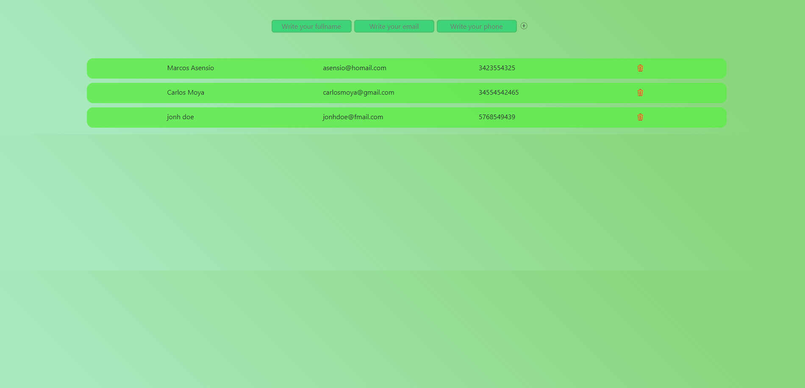
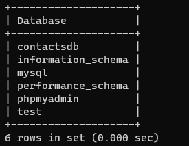
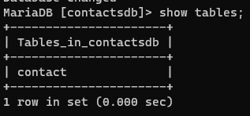
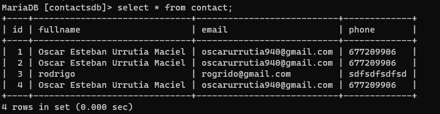

<h1>Agenda de Contactos</h1>

<h1>MYSQL</h1>

<h5>Mostar base de datos</h3>

- SHOW DATABASES;

 

<h5>Acceder a Tabla</h3>

- USE contactsdb;

 

<h5>Enseñar Tabla</h3>

-  show tables;

 

<h5>Acceder a Tabla</h3>

- Seleccionar todos de la tabla  contact

    - select * from contact;
    

    

<h1>Variables de entorno</h1>

- instalar python-dotenv 
  - pip install python-dotenv
- Crear .env
- Crear archivo de configuracion(config.py)
- importar config en index.py

<h1>Crear txt con dependencias</h1>

- pip freeze > requirements.txt

